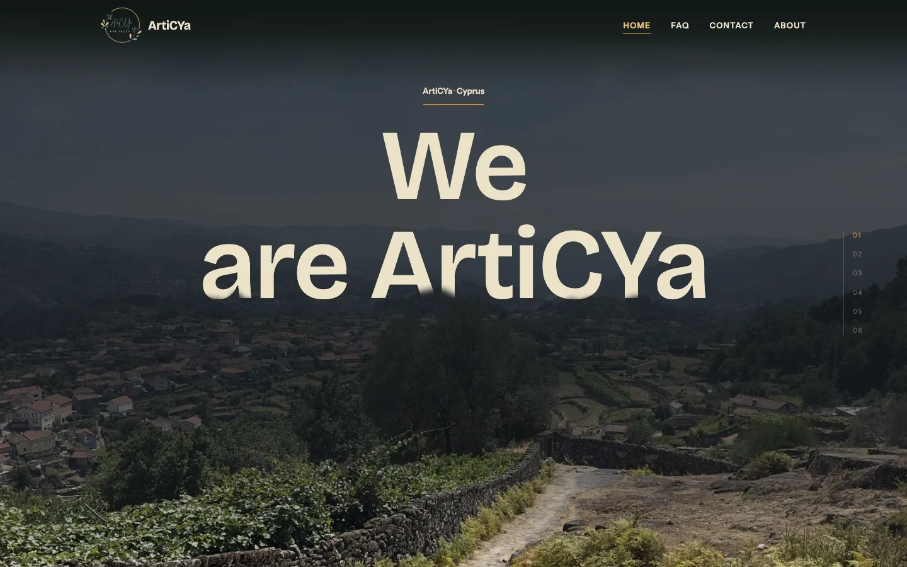

# ArtiCYa

Website for ArtiCYa, a Cyprus-based Erasmus+ youth organisation. Static site,
built and deployed with GitHub Actions.

**Live:** https://andreasvas04.github.io/articya-website/

[](https://github.com/AndreasVas04/articya-website/actions/workflows/deploy.yml)

<p align="center">
  
</p>
<p align="center"><sub>Home, 1440×900.</sub></p>

## What it does

- A hero that opens on the wheel or a finger drag: the scene's progress
  tracks the input pixel for pixel, not a fixed-time animation, and it plays
  once per page load.
- Each section pins a full-bleed photograph while its text and numbers
  settle over it, so a page reads as one continuous scene rather than
  stacked blocks.
- A rotating Earth in WebGL sits beside "What we do." three.js loads only
  when the section is about to be seen; it never touches the first page
  load, aside from about 1 kB for the loader itself.
- The About page closes with a mosaic of photographs that assembles as you
  scroll and dissolves into a single frame before the footer.
- Hovering or touching a nav link starts prefetching that page's hero
  photograph immediately, ahead of the click.
- Two checks run on every build: one diffs the page's visible text against
  frozen snapshots, the other asserts no responsive image is ever asked to
  upscale.

## Stack

- **Next.js 15.5** — App Router, static export
- **TypeScript 5.9**
- **Tailwind CSS 4.3** — CSS-first config, no `tailwind.config.js`
- **three.js 0.185** — loaded on demand for the WebGL globe only
- **GitHub Actions → GitHub Pages** — build and deploy on push to `main`

## Engineering notes

- **Responsive image ratio gate.** Every photograph is built at a ladder of
  widths in AVIF/WebP/JPEG at build time. `verify:placements` then asserts,
  across 132 placements and 7 viewports, that painted width × device pixel
  ratio never exceeds the fetched image's own width — no browser is ever
  asked to upscale a photograph.
- **Contrast gate.** Every text/ground pairing is measured at the glyph's
  own rendered ink on the composite output, swept in 5px steps across each
  page's full scroll range, against a 4.5:1 floor for body text and 3.0:1
  for large text.
- **`svh`, not `vh`.** Mobile Safari doesn't give a page its full screen
  height: a 390-wide iPhone renders at 664px with the URL bar showing and
  750px with it collapsed, never the device's own 844px. Grounds are sized
  in `dvh`, content in `svh`, and bare `vh` doesn't appear in the codebase.
- **Composited-layer budget.** The home page's paint layers were cut from
  23 to 13, its backing store from 186.7MB to 95.2MB, and the memory a 2.5×
  pinch-zoom would decode from 1299MB to 728MB.
- **Content-hash CI cache.** The responsive-image variants are cached in
  Actions, keyed on a hash of the source photographs and the two pipeline
  scripts. The encode step is 96% of a cold build, so a run that touches
  neither turns a projected ~27-minute build into about one minute.
- **Text-parity check.** `verify:text` diffs the rendered visible text of
  all four pages against frozen HTML snapshots, character for character,
  so a refactor can't silently drop or reorder copy.
- **Post-export asset pruning.** A script scans the exported HTML for the
  images each route actually references and drops the rest from the deploy
  — 259 unreferenced files, 170MB, off the last build.

## Run locally

```bash
npm install
npm run dev          # http://localhost:3000
npm run build:pages  # static export for GitHub Pages, out/
```

Verification scripts (also run as part of `build:pages`):

```bash
npm run verify:text        # visible-text parity against frozen snapshots
npm run verify:placements  # responsive-image ratio gate
```

## Photography

All photographs, the logo and site copy are ArtiCYa's own, © ArtiCYa, and
are not licensed for reuse. See [LICENSE](LICENSE) for what the MIT grant
below covers and what it excludes.

## Author

**Andreas Vasiliou** — [github.com/AndreasVas04](https://github.com/AndreasVas04)
