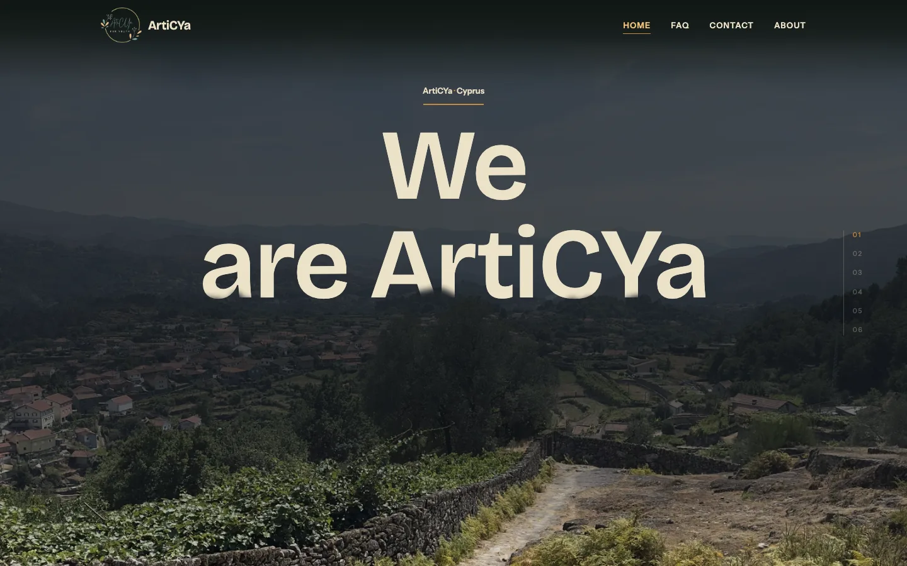

# ArtiCYa

Website for ArtiCYa, a Cyprus-based Erasmus+ youth organisation. Static site,
built and deployed on Vercel.

**Live:** https://articya.vercel.app/

<p align="center">
  
</p>
<p align="center"><sub>Home, 1440×900.</sub></p>

## What it does

- A hero that opens on the wheel or a finger drag: the scene's progress
  tracks the input pixel for pixel, not a fixed-time animation, and it plays
  once per page load.
- The page scrolls over one fixed, full-bleed layer of photographs that
  turns at the reader's own scroll rate. Sections paint no ground of their
  own, so a page reads as one continuous scene rather than stacked blocks.
- A rotating Earth in WebGL sits beside "What we do." three.js loads only
  when the section is about to be seen; it never touches the first page
  load, aside from about 1 kB for the loader itself.
- The About page closes with a mosaic of photographs that assembles as you
  scroll and dissolves into a single frame before the footer.
- Hovering or touching a nav link starts prefetching that page's hero
  photograph immediately, ahead of the click.
- Two checks run on every build: one diffs the page's visible text against
  frozen snapshots, the other asserts no responsive image is ever asked to
  upscale.

## Stack

- **Next.js 15.5** — App Router, static export
- **TypeScript 5.9**
- **Tailwind CSS 4.3** — CSS-first config, no `tailwind.config.js`
- **three.js 0.185** — loaded on demand for the WebGL globe only
- **Vercel** — a production build from `main` and a preview for every other
  branch; the old GitHub Pages address redirects to the same page here

## Engineering notes

- **Responsive image ratio gate.** Every photograph is built at a ladder of
  widths in AVIF/WebP/JPEG at build time. `verify:placements` then asserts,
  across 142 placements and 7 viewports, that painted width × device pixel
  ratio never exceeds the fetched image's own width — no browser is ever
  asked to upscale a photograph.
- **Contrast gate.** Every text/ground pairing is measured at the glyph's
  own rendered ink on the composite output, swept in 5px steps across each
  page's full scroll range, against a 4.5:1 floor for body text and 3.0:1
  for large text.
- **`svh`, not `vh`.** Mobile Safari doesn't give a page its full screen
  height: a 390-wide iPhone renders at 664px with the URL bar showing and
  750px with it collapsed, never the device's own 844px. Grounds are sized
  in `dvh`, content in `svh`, and bare `vh` doesn't appear in the codebase.
- **Composited-layer budget.** The home page's paint layers were cut from
  23 to 13, its backing store from 186.7MB to 95.2MB, and the memory a 2.5×
  pinch-zoom would decode from 1299MB to 728MB.
- **Encode once.** The responsive-image variants are keyed on a signature
  of everything that can change them: the frames the pages name, their
  originals, the grade, and the pipeline with its config. A build whose
  signature matches restores the finished tree from `.next/cache`, which
  Vercel keeps between deploys, instead of encoding it. A cold encode runs
  frames in parallel, about 13 minutes on two cores; a warm build takes
  under a minute.
- **Text-parity check.** `verify:text` diffs the rendered visible text of
  all four pages and the 404 against frozen HTML snapshots, character for
  character, so a refactor can't silently drop or reorder copy.
- **Only what a page shows.** The pipeline reads the pages' own source for
  the photographs they name and encodes only those — 13 frames and 336
  files — and a path it can't produce stops the build. After the export, a
  script scans the HTML for the images each route actually requests and
  drops the rest from the deploy: the originals and graded masters, 81.5MB.

## Run locally

```bash
npm install
npm run dev          # http://localhost:3000
npm run build        # static export at the site root (Vercel, any static host), out/
npm run build:pages  # the same export under /articya-website/, the old Pages path, out/
```

Verification scripts (both run at the end of every build):

```bash
npm run verify:text        # visible-text parity against frozen snapshots
npm run verify:placements  # responsive-image ratio gate
```

## Photography

All photographs, the logo and site copy are ArtiCYa's own, © ArtiCYa, and
are not licensed for reuse. See [LICENSE](LICENSE) for what the MIT grant
below covers and what it excludes.

## Author

**Andreas Vasileiou** — [github.com/AndreasVas04](https://github.com/AndreasVas04)
